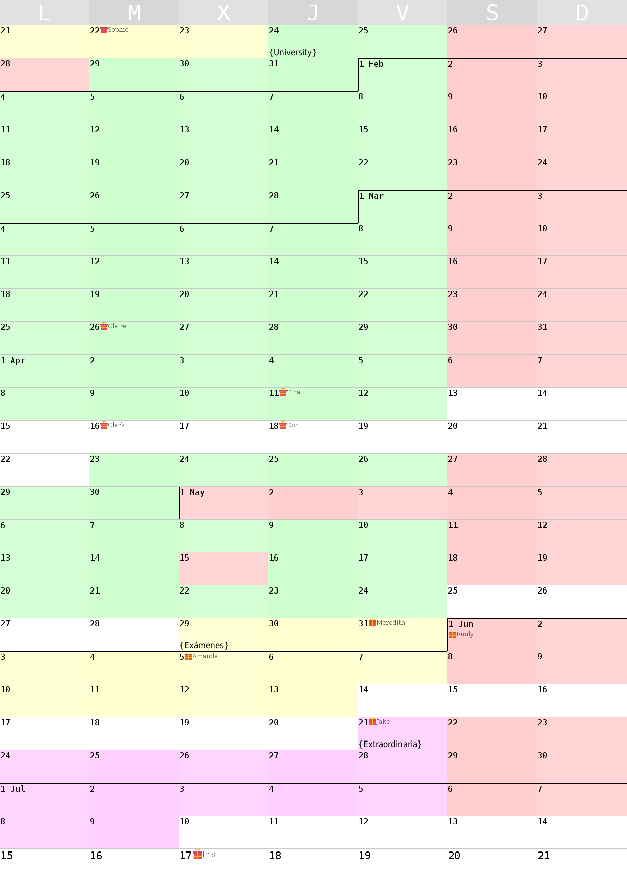

# CalendarCreator
Create useful calendars.

### Dependencies
- Python 3
- pygame
- [Dejavu Fonts](https://dejavu-fonts.github.io/) (You might already have them installed)

### Usage

To get a custom calendar first configure `config.json` and then run `main.py`.

## Screenshots:

##### Note

This was designed with self-use intention. Feel free to adapt
the code and make it more suitable for your intentions.

Icons made by [Freepik](http://www.freepik.com) from [www.flaticon.com](https://www.flaticon.com/) is licensed by [CC 3.0 BY](http://creativecommons.org/licenses/by/3.0/)